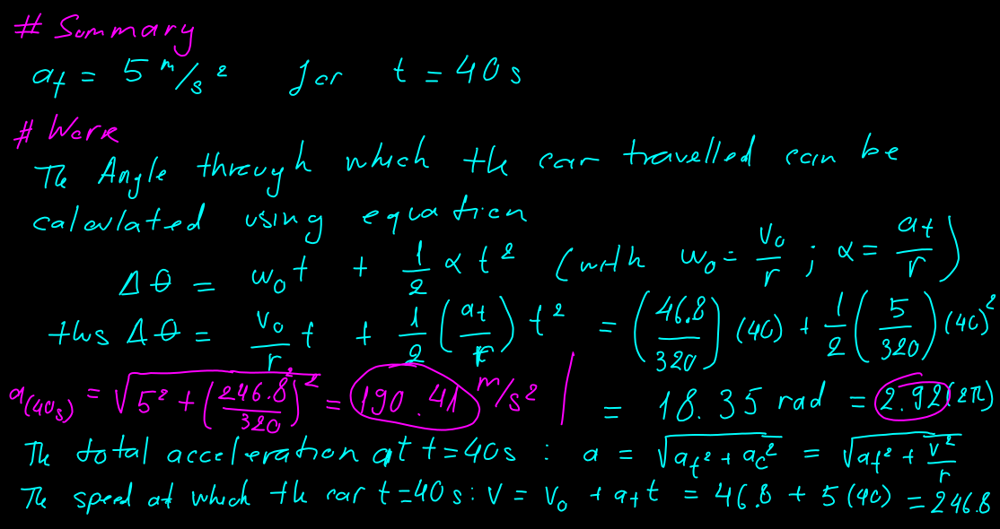
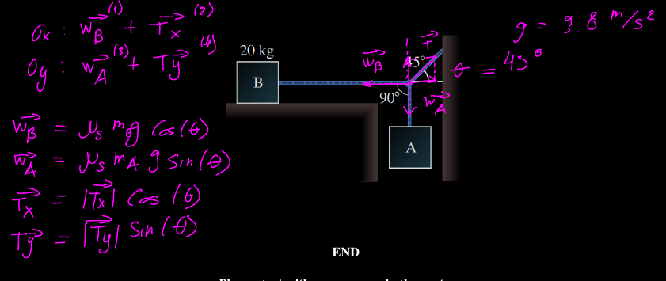
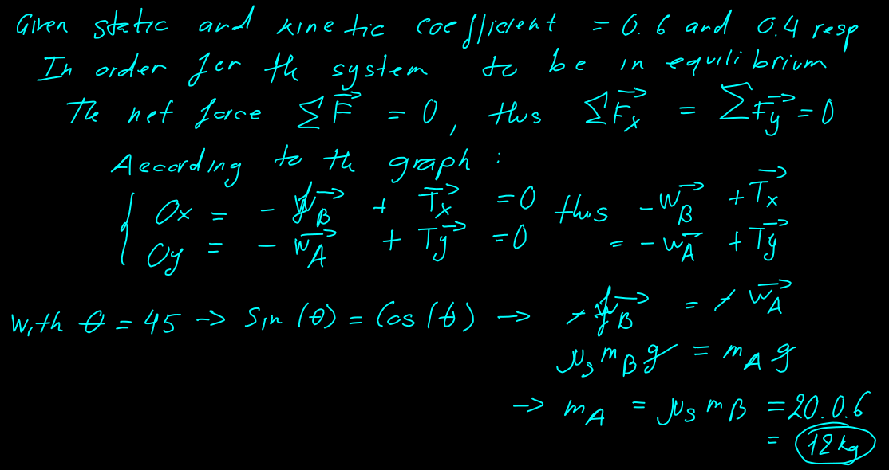
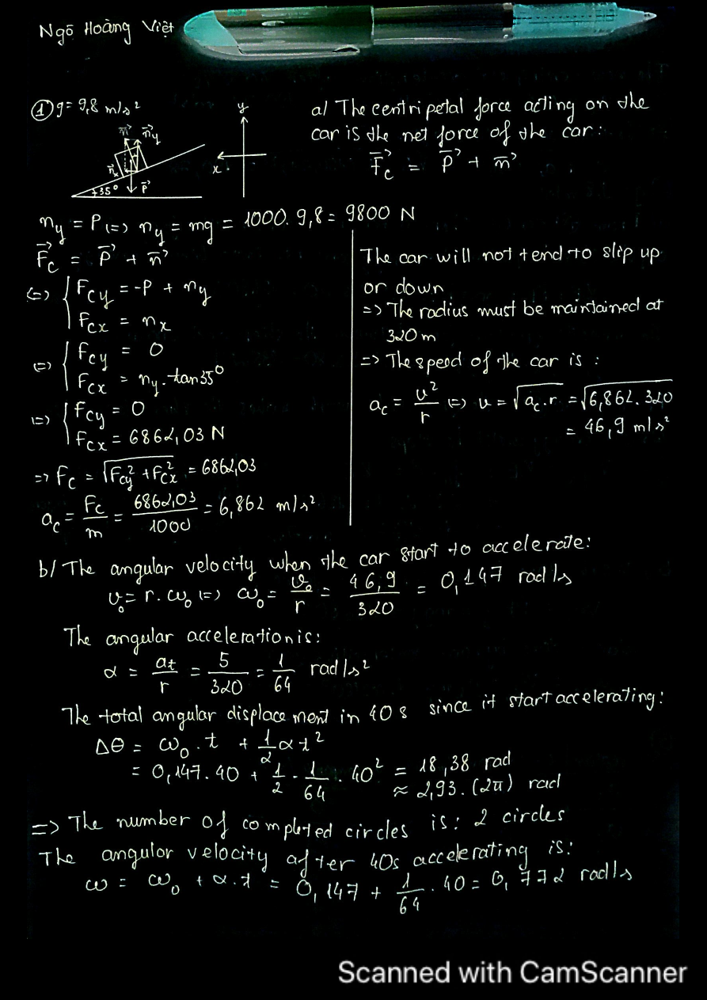
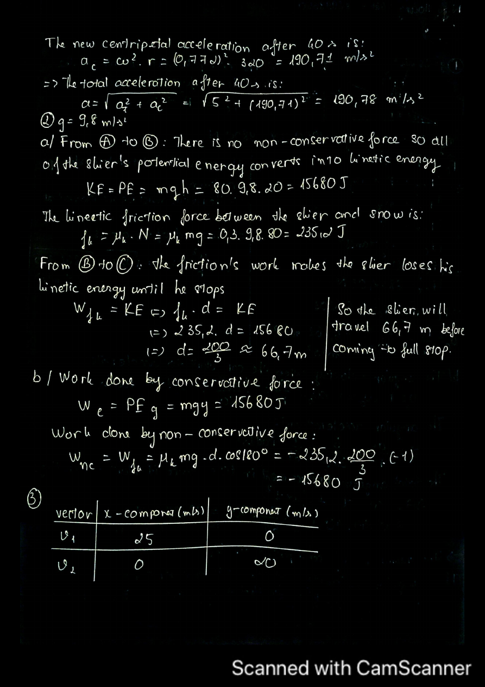
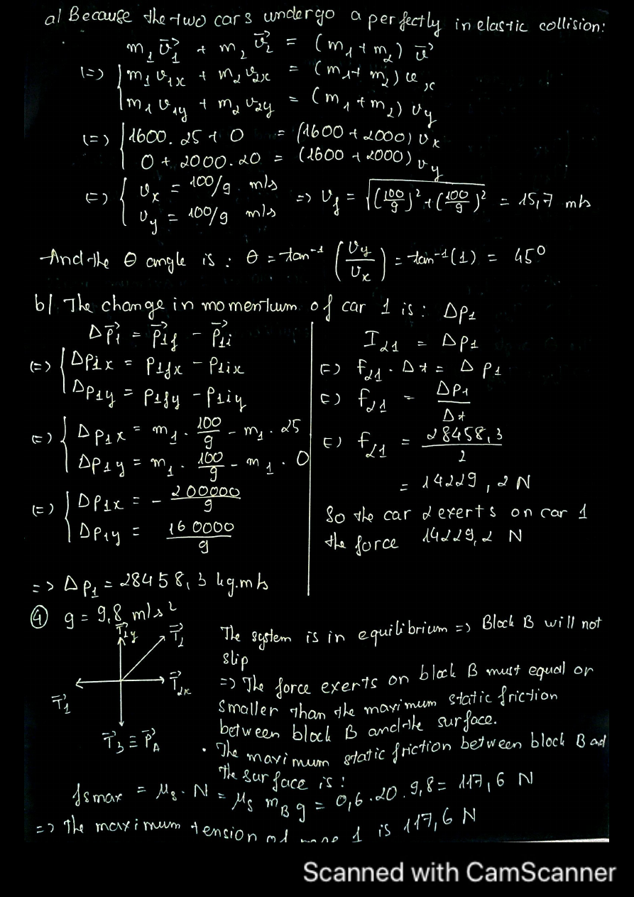
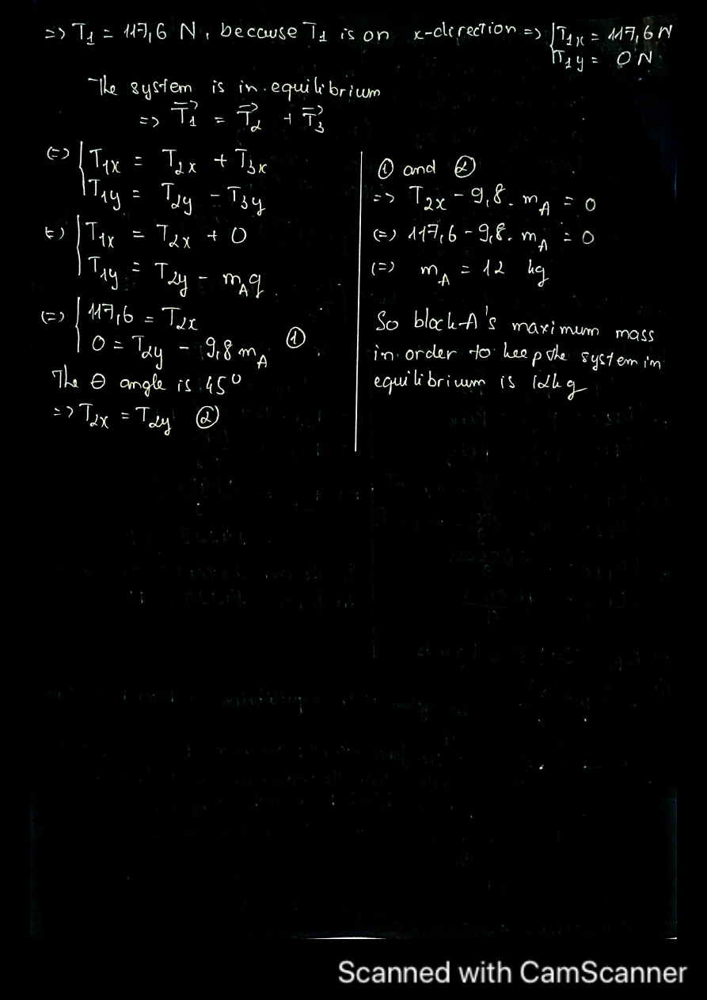

# Assessment 2

## My work

### Question 1

> A racetrack has $\theta = 350$ banked curves with the maximum radius of 320 m as shown in the below figure. If the car negotiates the curve too slowly, it tends to slip down the incline of the turn, whereas if it is going too fast, it may begin to slide up the incline. The car mass is 1000 Kg.

#### i. Section a

Find the speed of the car on this banked so the car will not tend to slop down or slide up the incline

<p align="center">
  
</p>

#### ii. Section b

At 40s from acceleration how many cycle has the car completed and find its total acceleration a at $t = 40s$

<p align="center">
  
</p>

### Question 2

> A skier starts from rest at the top of a frictionless incline of height 20 m (at point A) as shown in the figure. At the bottom of the incline, the skier encounters a horizontal surface where the coefficient of kinetic friction between the skis and snow is 0.3. The mass of the skier is 80 Kg. Neglect air resistance.

How far does the skier travel on the horizontal surface before coming to a full stop at C

Calculate work done by conservative force and non-conservative force separately

<p align="center">
  
</p>

<details>
<summary>Code</summary>

[embedmd]:# (graph.py)
```py
import numpy as np
import pylab as pyl

x = np.linspace(-5, 5, num=20)
y = np.sqrt(x)

pyl.plot(x, y)
pyl.show()
```

</details>

### Question 3

> A car 1 with mas 1600 Kg travelling East at a speed of 25 m/s collides at an intersection with a car 2 of 2000 Kg travelling North at a speed of 20 m/s, as shown in the figure.

#### i. Section a

Find the `velocity` of the cars after the collision

<p align="center">
  
</p>

#### ii. Section b

Find the force that car 2 acting on car 1 during the collision

<p align="center">
  
</p>

### Question 4 

> Block B in below figure rests on a surface for which the static and kinetic coefficients of friction are 0.6 and 0.4, respectively. The ropes are massless

What is the maximum mass of block A for which the system is in equilibrium

<p align="center">
  
  
</p>

## Solution

<details>
  <summary></<summary>Solution</summary>
  <p align="center">
    
    
    
    
  </p>
</details>
