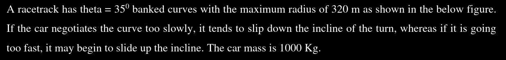
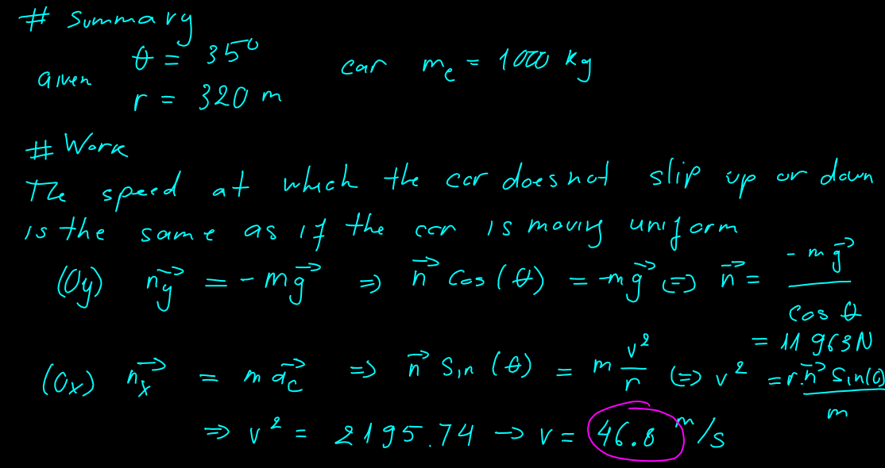
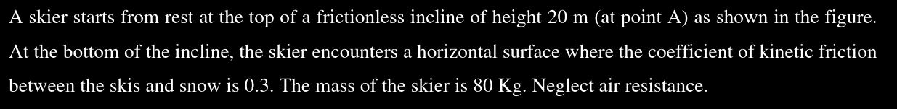
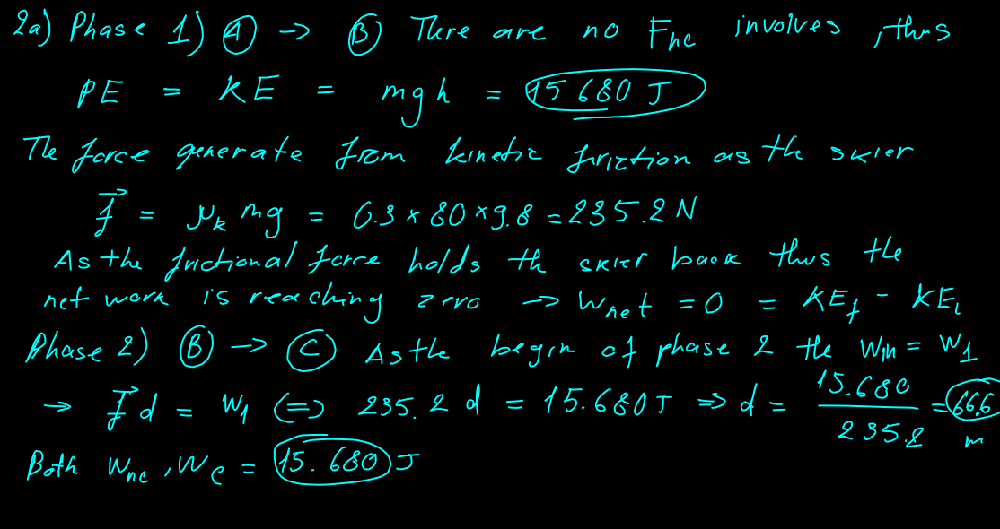
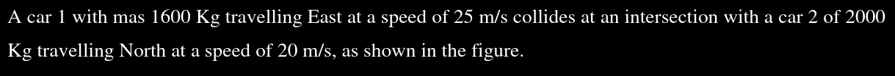
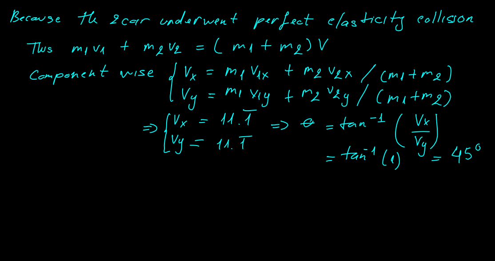
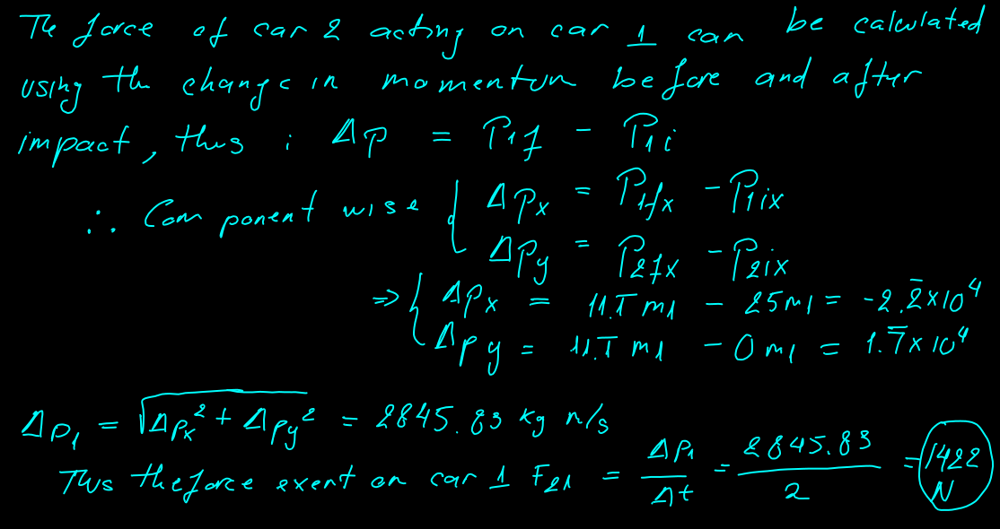

# Assessment 2

## My work

### Question 1

  

#### Section a

Find the speed of the car on this banked so the car will not tend to slop down or slide up the incline

  

#### Section b

At 40s from acceleration how many cycle has the car completed and find its total acceleration a at $t = 40s$

  

### Question 2

  

How far does the skier travel on the horizontal surface before coming to a full stop at C

Calculate work done by conservative force and non-conservative force sperately

  

### Question 3

  

#### Section a

Find the `velocity` of the cars after the collision

  

#### Section b

Find the force that car 2 acting on car 1 during the collision

  

