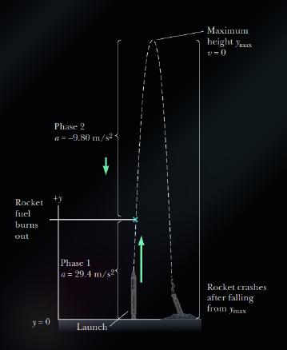
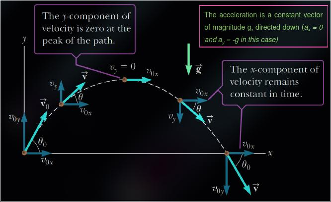
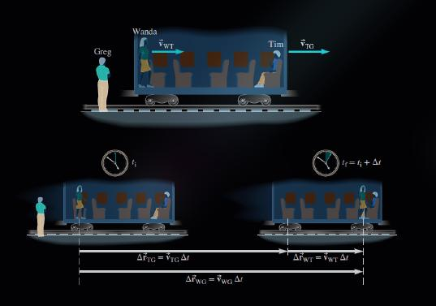

# Special Types of Motion

## Free Fall

* **Free falling motion** is the motion of an object moving under the influence of gravity only and no other forces (the air resistance if negligible) .
* Object in free fall experiences a constant downwards acceleration of magnitude $g = 9.8 m/s^2$

> [!TIP]
> To calculate free fall motion [equation3](#motion-with-constant-acceleration) becomes very useful

## Projectile Motion

* **Projectile Motion** is also the motion of an object moving under the influence of gravity only.
* The $y$-component is experiencing [Free Fall motion](#free-fall).
* The $x$-component of the velocity remains constant all the time.

> [!NOTE]
> The $x$-component of the velocity is *zero* at the peak of the path

## Relative Motion

