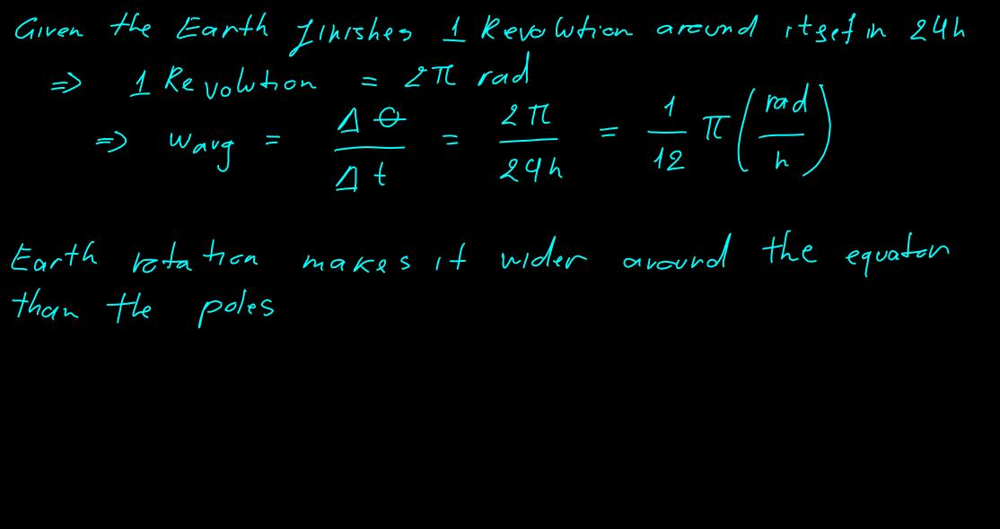
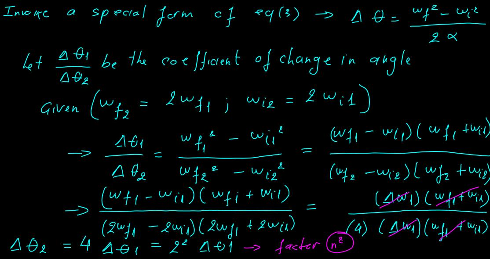

# Lab 4 - Circular Motion

> Problems can be found [here](https://mega.nz/file/XK5kHQpB#IbjB4X42M-39T1G5ieqaCLjQK2ZhFKFhpDyIzEeopEg)

## 7.1 Angular Speed and Angular Acceleration

### Question 1

(a) Find the angular speed of Earth’s rotation about its axis. 
(b) How does this rotation affect the shape of Earth?

  

### Question 4

> A potter’s wheel moves uniformly from rest to an angular speed of 1.00 rev/s in 30.0 s. 

(a) Find its angular acceleration in radians per second per second. 

  

(b) Would doubling the angular acceleration during the given period have doubled final angular speed?

  

## 7.3 Relations between Angular and Linear Quantities

### Question 7

> A bicycle is turned upside down while its owner repairs a flat tire. A friend spins the other wheel and observes that drops of water fly off tangentially. She measures the heights reached by drops moving vertically (Fig. P7.8). A drop that breaks loose from the tire on one turn rises vertically 54.0 cm above the tangent point. A drop that breaks loose on the next turn rises 51.0 cm above the tangent point. The radius of the wheel is 0.381 m. 

  

(a) Why does the first drop rise higher than the second drop? 

(b) Neglecting air friction and using only the observed heights and the radius of the wheel, find the wheel’s angular acceleration (assuming it to be constant).

### Question 8

> A machine part rotates at an angular speed of 0.06 rad/s; its speed is then increased to $2.2 \frac{rad}{s}$ at an angular acceleration of $0.70 \frac{rad}{s^2}$. 

(a) Find the angle through which the part rotates before reaching this final speed. 

  

(b) In general, if both the initial and final angular speed are doubled at the same angular acceleration, by what factor is the angular displacement changed? Why?

  

