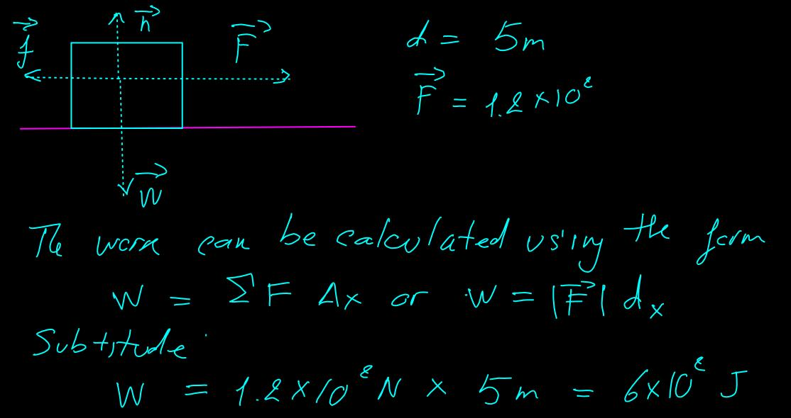
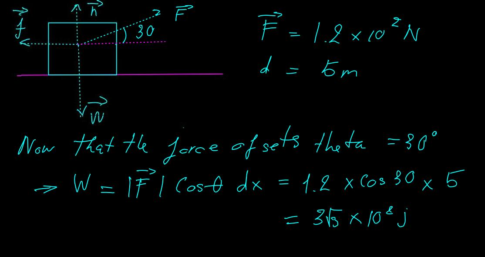
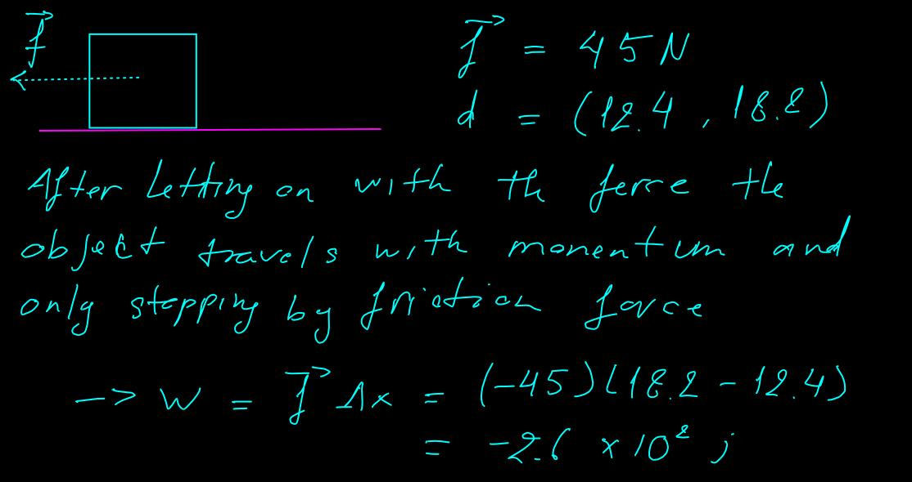
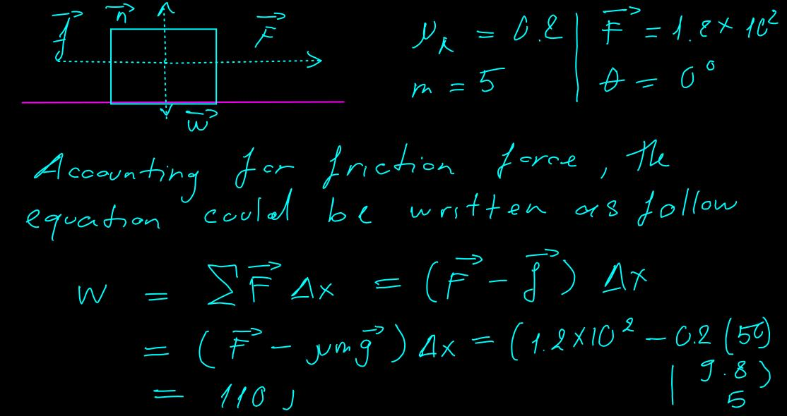

# Lab 5 - Work and Energy 

## Practice Problems

### Problem 1. Work

* An Eskimo returning from a successful fishing trip pull a sled loaded with salmon. The total mass of the sled and salmon is 50.0 kg, and the Eskimo exerts a force of magnitude 1.20 x 10^2 N on the sled by pulling on the rope 

  1. How much work does he do on the sled if the rope is horizontal to ground and he pulls the sled 5.00 m?

  

  2. How much work does he do on the sled of $\theta = 30 \textdegree $ and he pulls the sled the same distance

  

  3. At  coordinate position of 12.4m, the Eskimo lets up on the applied force. A friction force 45 N between the ice and the sled brings the sled to rest at position of 18.2m. How much `work` does friction do on the sled?

  

### Problem 2 (Continuation of [Problem 1](#problem-1))

* Supposed the coefficient of kinetic friction between the loaded 50.0 kg sled and the snow if 0.200 

  1. The Eskimo again pulls the sled 5 m exerting a force of 1.20 x 10^2 N and an angle of 0. 

  

  2. Repeat the calculation at angle of $30 \textdegree$

