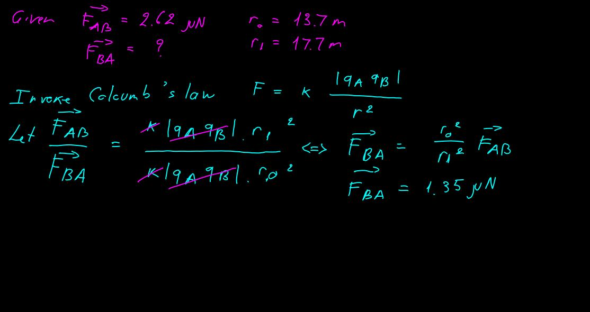

# Lab 8 - Electric Field

> Visit [Practice Problems](https://mega.nz/file/CPgkARpb#ncCB2Q8Gk_xJ6zNJWpimPZqv_jF_3iY7F3qGo3K7OhE) for more details

## Practice Problem 1

### 23.3 Coulomb's Law

#### Problem 3

Two protons in an atomic nucleus are typically separated by a distance of $2 \times 10^{-15} m$. The electric repulsive force between the protons is huge, but the attractive nuclear force is even stronger and keeps the nucleus from bursting apart. What is the magnitude of the electric force between two protons separated by $2.00 \times 10^{-15} m$?

> $$ F = \frac{k_e |q_1||q_2|}{r^2} \text{ with } k = 8.99 \times 10^9 \text{ and } q = 1.6 \times 10^{-19}$$
>
> Thus, $\bf{F = 57.5N}$

#### Problem 4

A charged particle A exerts a force of $2.62 \text{  } \mu N$ to the right on charged particle B when the particles are 13.7 mm apart. Particle B moves straight away from A to make the distance between them 17.7 mm. What vector force does it then exert on A?

<p align="center">
  
</p>

#### Problem 5

In a thundercloud, there may be electric charges of +40.0 C near the top of the cloud and -40.0 C near the bottom of the cloud. These charges are separated by 2.00 km. What is the electric force on the top charge?

> Invoke Coloumb's Law $F = k_e \frac{|q_{1} q_{2}|}{r^2}$
> $$F = k_e \frac{q_{up} \text{  } q_{down}}{r^2} = 8.86 \times 10^{-12} \frac{(-40) \times (40)}{(2 \times 10^3)^2}$$ 


[embedmd]:# (./lab/code/w8-electric.py /.*e =.*/ /.*F =.*/)
```py
e = 8.8542*10**(-12)
k = 1 / (4*np.pi*e)
F = k * (-40.0)*(40.0) / (2*10**3)**2
```


