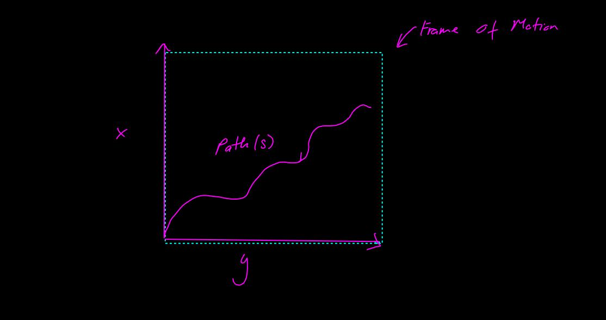

# Motion in Two Dimensions

## Motion in 2D

By looking seperatly at the moitions along two perpendicular aces the $y$-direction and $x$-direction. Each component becomes a one-dimensionnal problems.

## Position and Displacement Vectors

* To describe motion in two dimension and above use a coordination system.
* The **Position vector** from the origin to point $P_(x, y)$ is $\vec{r}(t)$.
$$\vec{r}(t) = r_x \vec{i} + r_y \vec{j} = x \vec{i} + y \vec{j}$$
* The **Displacement Vector** is denoted by the difference between initial position and final position
$$\Delta \vec{r} = \vec{r_f} - \vec{r_i}$$

> [!NOTE]
>  If the particle is moving the variables $x, y, \text{ and z}$ are functions of time.
$$x = x(t) \text{ and } y =y(t)$$

## Velocity Vector

### Instantaneous Velocity

* **Instantaneous Velocity** can be calculated using the [derivative](kinematic.md/#instantaneous-velocity) of the position function with respect to time. The same can be applied in higher dimensions.
$$\vec{v}(t) = \lim_{\Delta t \to 0} \frac{\vec{r}(t + \Delta t) - \vec{r}(t)}{\Delta t} = \frac{d \vec{r}}{dt}$$
* Writing in term of components of $\vec{v}(t)$, since:
$$\vec{v}(t) = v_x (t) \vec{i} + v_y (t) \vec{j}$$
with
$$v_x (t) = \frac{dx(t)}{dt} \text{ and } v_y (t) = \frac{dy(t)}{dt}$$

### Average Velocity

* **Average Velocity** is denoted as the difference between position of the initial position and final position over time
$$\vec{v}_{avg} = \frac{\vec{r}(t2) - \vec{r}(t1)}{t_2 - t_1}$$

## Acceleration Vector

* **Instantaneous Acceleration** can be obtained from the [derivarive](kinematic.md/#acceleration) with respect to time of the velocity:
$$\vec{a}(t) = \lim_{t \to 0} \frac{\vec{v}(t + \Delta t) - \vec{v}(t)}{\Delta t} = \frac{d \vec{v}(t)}{dt}$$
* Writting in term of components of $a(t)$, since:
$$\vec{a}(t) = \frac{d v_x(t)}{dt} \vec{i} + \frac{d v_y(t)}{dt} \vec{j}$$
* Also since velocity is derivative of position function. It is possible to write acceleration as the second derivative of position with repect to time:
$$\vec{a}(t) = \frac{d^2 x(t)}{dt} \vec{i} + \frac{d^2 y(t)}{dt} \vec{j}$$

## 2D Motion with Constant Acceleration

As we seperate the term of $x \text{ and } y$ the motion with constant acceleration in 2D is therefore similar to the same motion in [1D](kinematic.md/#motion-with-constant-acceleration)

> 

>     
In term of $x$:

>     $$v_x = v_0x + a_x t$$
>     $$\Delta x = v_0x t + \frac{1}{2}a_x t^2$$
>     $$v^2_x = v^2_0x + 2a_x \Delta x$$
> 

> 

>     
In term of $y$:

>     $$v_y = v_0y + a_y t$$
>     $$\Delta y = v_0y t + \frac{1}{2}a_y t^2$$
>     $$v^2_y = v^2_0y + 2a_y \Delta x$$
> 

