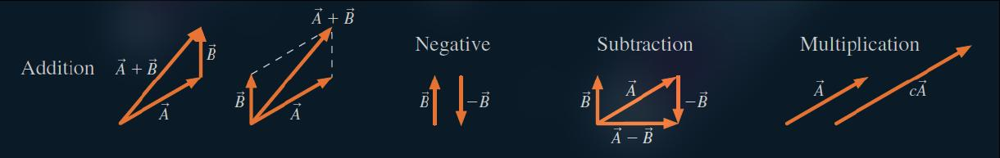

# Vector

## Vector Definition

  

* Length of the arrow represents magnitude
* Vector Notation: $\vec{A}$
* Magnitude  of a vector $A = |\vec{A}|$

## Unit Vector

  
  

* Unit vector is a vector which has a magnitude of 1

## Vector Components

### Components

    

* The x-component vector is parallel to the y-axis
* THe y-component vector is parallel to the x-axis

> [!TIP]
> 

> 
> 

>
> The components are the sides of a right thriangle with *hypotenuse* A and angle $\Theta$ 
> * The y-component is the opposite site so use $sin(\Theta)$
> * The x-component is the adjacent site so use $cos(\Theta)$

### Magnitude and Direction

* If the components are known, magnitude and angle can be calculate using
  * **Magnitude**: $$A = \sqrt{A_x^2 + A_y^2}$$
  * **Angle**: $$\Theta = \tan^-1{\left( \frac{A_y}{A_x} \right)}$$

## Vector Operations

### Graphical

Graphical representation of vector operations:

    

### Algebraical

Vector calculations are done component by component:

$$\vec{C} = 2\vec{A} + \vec{B} \Rightarrow C_{(x, y)} = 2A_{(x, y)} + B_{(x, y)}$$

