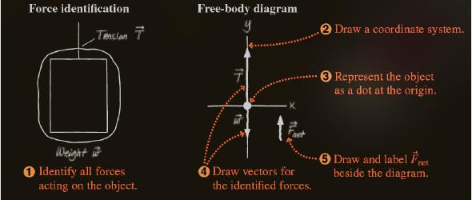

# Dynamics - Newton's Law of Motion

## Forces

### Motion and Forces

* A force is commonly imagined as a push or a pull on some objects, perhaps rapidly (e.g when we hit a tennis ball with a racket)
* Unit convertions: 
```
┌──────┬─────┬─────────────┬─────────────────┐
│System│ Mass│ Acceleration│ Force           │
├──────┼─────┼─────────────┼─────────────────┤
│SI    │ kg  │ m/s^2       │ N = kg*m/s^     │
├──────┼─────┼─────────────┼─────────────────┤
│U.S   │ slug│ ft/s^2      │ lb = slug*ft/s^2│
└──────┴─────┴─────────────┴─────────────────┘
```
* There are two basics calsses of forces:
  * __Contact forces__ are the forces that act on an object by touching it at a point of contact, forexample a string must by tied to an object to pull it
  * __Field force (Long-range forces)__ are the forces that act on an object without physical contact, for instance magnetism is a long-range force

## Newton's Law of Motion

### Newton's First Law of Motion

> An object moves with a `velocity` that is constant in magnitude and direction unless a non-zero net force on it
* __The net foce__ on an object is defined as the vector sum of all external forces exerted on the object.

> [!NOTE]
> _Internal Forces_ originates within the object itself and can _NOT_ change the object's `velocity`.
 

### Newton's Second Law of Motion

> The `acceleration` of an object is proportional to the net force acting on it an inversely proportional to its mass

$$\vec{a} = \frac{\sum \vec{F}}{m}$$

* Component wise formula:

$$\sum F_{x} = ma_{x} \text{ , } \sum F_{y} = ma_{y}$$

### Newton's Third Law of Motion

> if `object 1` and `object 2` interact, the forces $\vec{F_{12}}$ exerted by `object 1` on `object 2` is equal in magnitude but opposite in direction to the force $\vec{F_{21}}$ exerted by `object 2` on `object 1`
* Hence,

$$\vec{F_{12}} = - \vec{F_{21}}$$

## Apllication of Newton's Laws

* `Objects` in Newtonian mechanics are considered as particles, so rotataion motion is NOT considered.
* Friction  or masses fo any ropes or strings are neglected. With these approximations, the magnitde of the force exerted along a rope, called the __tension__, is the same at all points on the rope

> [!WARNING]
> __A free-body diagram__ represents the object as a particle and shows all the forces acting on the object.

* _An elevator, usspend by a cable, speeds up as it moces upward from the ground floor. The free-body diagram of the elevator is shown below:_



## Different Types of Force

### Gravitational force

* __The gravitaional force__ is mutual force of attreaction between any two objects in the _Universe_
> __Newton's law of universal gravitation__ :
> states that every paritcle in the universe attracts every other paricle iwth a force that is directly porpotional to the product of the masses of the particles and inverslu porpotional to the square of the distance between them

$$F_g = G \frac{m_1 m_2}{r^2} \text{  with  } G = 6.67 \times 10^{-11} N \cdot m^2 / kg^2$$

  * __The magnitude__ of the gravitational force acting on an object of mass `m` is called the weight `w` of the object

  $$w = mg$$

  * From the equation of gravitional force, an alternative definition of the weight of an object with mass `m` can be written with $M_E$ (the mass of Earth) and $r$ is the distance from the object to Earth;s center

  $$F_g = G \frac{m_1 m_2}{r^2}$$

  * Hence, the weight of the object with Earth:

  $$w = G \frac{M_E \cdot m}{r^2}$$

  * Divides both side by $m$:
  
  $$g = G \frac{M_E}{r^2}$$

### Contact Force

__A contact force__ perpendicular to the `contact surface` that prevents two solid objects from passing through one another is called the _normal force_ (in geometry the word _normal_ means _perpendicular_)

#### Friction

A contact force _parallel_ to the `contact surface` is called __friction__. There are two types of friction `static` and `kinetic` (or sliding) friction

##### Static Friction

* When NO _slipping_ or _sliding_ occurs, the friction is called __static__
  * _Static friction acts to try to __prevent__ object from starting to slide_
* __Maximmum force od static friction__ with the `coefficient` of static friction is a dimensionless number:

  $$\mathord{\mathit{f_s}} \le \mu_s n \text{  and  } \mathord{\mathit{f_{s, max}}} = \mu_s N$$

###### Kinetic Friction

* When _slipping_ or _sliding_ occurs, the friction is called __kinetic__
  * _kinetic friction acts to try to __make__ object slide_
* __Force of kinetic friction__ with the `coefficient` of kinetic friction is a dimensionless number

  $$\mathord{\mathit{f_k}} = \mu_k N$$

## Course ressources

* [Lecture Slides](https://mega.nz/file/TSI3BarR#lCuPq0EoAMSdZH73XAhKyUIvwNqDB27LUOze5RVO_F4)

## Aditional resources

* Reading resources
  * [Physics for scientists and engineers with modern physics](https://rmitlibraryvn.rmit.edu.vn/permalink/84RVI_INST/1kigfja/alma991001154609006821)
  * [OpenStax](https://collection.bccampus.ca/textbooks/university-physics-353/)
* Video resources
  [Newton's Law of Motion](https://youtu.be/kKKM8Y-u7ds)
