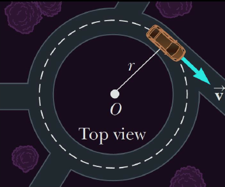
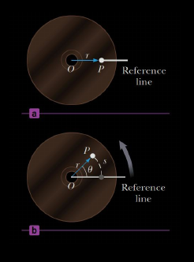
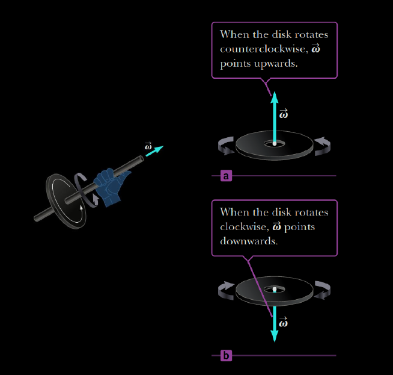
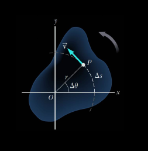
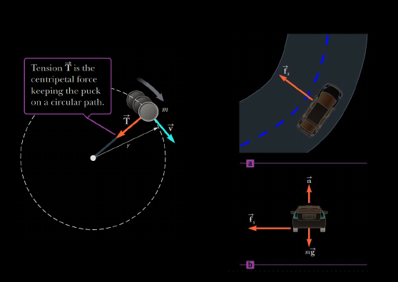

# Circular Motion

## Angular Position

  
Example

  

1. The point P on a rotating compact disc at $t=0$
2. As the disc rotate, P move through an arc length $s$
* The angle _theta_ is called the `angular position` (subtended by an `arc length` $s$ along a circle of radius r, measured in radians counterclockwise from the (+) x-axis) and is analogous to the linear position

$$\theta = \frac{s}{r} \text{ with } 360 \textdegree = 2 \pi \text{ } rad$$

## Angular Displacement

* As a point on the compact disc moves from A to B, the disc rotates through the angle which is call `angular displacement`
  * The difference in its final and initial angles

$$\Delta \theta = \theta_f - \theta_i$$

## Angular Velocity (Speed)

* The `average angular velocity` is the average rate of change of the angular displacement 

$$\omega_{av} = \frac{\theta_f - \theta_i}{t_f - t_i} = \frac{\Delta \theta}{\Delta t}$$

* If we let the time interval $\Delta t$ become shorter and shorter, we are averaging over smaller and smaller time intervals, then the average angular velocity becomes the `instataneous angular velocity`

$$\omega = \lim_{\Delta t \to 0} \frac{\Delta \theta}{\Delta t}$$

## Angular Acceleration

* An object's `sverage acceleration` during the time interval is the change in its `angular speed` divided by time interval

$$\alpha_{av} = \frac{\omega_f - \omega_i}{t_f - t_i} = \frac{\Delta \omega}{\Delta t}$$

* The `instataneous angular acceleration`  is the limit of the average angular acceleration as the time interval approaches zero

$$\alpha = \lim_{\Delta t \to 0}\frac{\Delta \omega}{\Delta t}$$

## Angular Quantities and Vectors

  

* The `direction` of the angular velocity vector can be found with the [Right Hand Rule](./assets/w4-circular/example41.jpg)
* The `direction` of the angular `acceleration` and the angular `velocity` are
  * __Same__ if the angular `speed` is _increasing_ with _time_
  * __Opposite__ if the angular `speed` is _decreasing_ with _time_

## Rotation Motion Under Constant Angular Acceleration

`If the object undergoes rotation motion about a fixed axis under a constant angular accerleration, its motion can be described with the following set of equations which are in the similar manner to the linear 1D motion with constant accerleration: `

* Linear Motion with $a$ Constant

> $$v = v_i + at$$
> 
> $$\Delta x = v_i t + \frac{1}{2} a t^2$$
> 
> $$v^2 = v^2_i + 2a \Delta x$$

* Rotation Motion About a Fixed Axis with $\alpha$ Constant

> $$\omega = \omega_i + \alpha t$$
> 
> $$\Delta \theta = \omega_i t + \frac{1}{2} \alpha t^2$$
> 
> $$\omega^2 = \omega^2_i + 2 \alpha \Delta \theta$$

## Relations between Angular and Linear Quantities

  

### Tangential Velocity

* The `tangential velocity` of a point on a rotating object equals the `distance` of that point from the axis of rotation _multiplied_ by the `angular velocity`
$$v_t = r \omega$$

### Tangential Acceleration

* The `tangential acceleration` of a point on a rotating object equals to the `distance` of that point from the axis of rotation multiplied by the `angular acceleration`

$$a_t = r \alpha$$

## Centripetal Acceleration

### Constant Speed

* Consider _the circular motion of an object with constant speed_ 
  * (+) The `velocity vectors` have the same magnitude, corresponding for the same speed 
  * (-) BUT `directions` are different 
    * `=>` There exists an `accerleration vector` pointing inwards (towards the center of the circle), called `centripetal acceleration` (center-seeking) acceleration .Its magnitude is given by

  
<b>PROOF</b>

  * As the particle moves counterclockwise in time $\Delta t$ on the circular path
    * The `position vector` moves from $\vec{r}(t) \text{ to } \vec{r}(t + \Delta t)$
    * The `velocity vector` has constant magnitude and its tangent to the path as it changes from $\vec{v}(t)$ to $\vec{v}(t + \Delta t)$, changing its direction only
    * Since `velocity vector` $\vec{v}(t)$ is _perpendicular_ to the `position vector` $\vec{r}(t)$. The triangle form from the `position vector` $\vec{\Delta r}$, and `velocity vector` and $\vec{v}$ are similar
    * Since $|\vec{r}(t)| = |\vec{r}(t + \Delta t)|$ and $|\vec{v}(t)| = |\vec{v}(t + \Delta t)|$ 
      * `=>`the two triangles are _isosceles_ 

  

  Thus,

  $$\frac{\Delta v}{v}  = \frac{\Delta r}{r} \text{ or } \Delta v = \frac{v}{r} \Delta r$$

  $$a = \lim_{\Delta t \to 0} \frac{\Delta v}{\Delta t} = \frac{v}{r} \left( \frac{\Delta v}{\Delta t} \right) = \frac{v^2}{r}$$

$$a_c  = \frac{v^2}{r} \text{ and } a_c = \frac{r^2 \omega^2}{r} = r \omega^2$$

### Varying Speed

* When an object moves in a circle but is _speeding up_  or _slowing down_
  * A `tangential component` of acceleration is also present
  * This `tangential component` and the `centripetal components` of acceleration are _perpendicular_ to each other

$$a = \sqrt{a^2_t + a^2_c}$$

### Centripetal Force

* Any object moving in a `circular` path must have a `net force` exerted on it that is directed toward the center of the path

  

## Course Resources

* __Lecture Slides__
  1. [Circular Motion](https://mega.nz/file/bSoRWbgJ#ifyBIVGMqXRal9JgcyMMlA8-7AjODqh2XUfPvLnG0KI)

## Additional Resources

* __Reading Resources__
  1. [OpenStax](https://collection.bccampus.ca/textbooks/university-physics-353/)
  2. [Physics for scientiests and engineering with modern physics](https://rmitlibraryvn.rmit.edu.vn/permalink/84RVI_INST/1kigfja/alma991001154609006821)

* __Watching Resources__
  1. [Uniform Circular Motion](https://youtu.be/bpFK2VCRHUs)
  2. [Rotational Motion](https://youtu.be/fmXFWi-WfyU)
