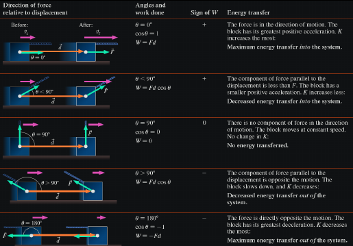
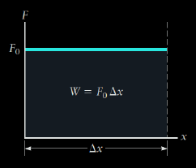
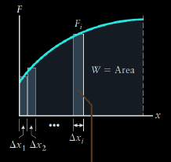
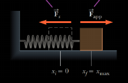
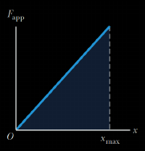
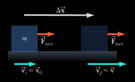
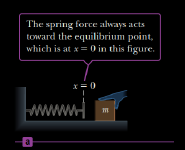
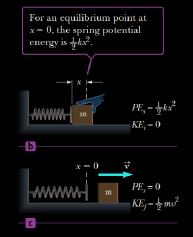

# Lecture 5 - Work and Energy

## Work 

In physics, work is done only if an `object` is moved through some displacement while a `force` is applied on it

  

$$W = (F \cos(\theta))d$$

> [!NOTE]
> SI unite: joule (J) = Newton $\cdot$ meter (N $\cdot$ m) = kg $\cdot \text{ } m^2 / s^2$

The work done by a variable force acting on an object that undergoes a displacement is equal to the area under the graph of $F_x$ versus $x$

### Work Done by a Constant Force

  

### Work Done by a Varying Force

  

$$W \approx F_1 \Delta x_1 + F_2 \Delta x_2 + F_3 \Delta x_3 + \cdots$$ 

#### Work done by an external agent

Now let's determine the `work` done by an external agent on the block as the `spring` is stretched very slowly  

  

During this same time the spring has done exactly the same amount of work, but that work is _negative_, because the spring force is points in the opposite direction of the motion  

  

$$F_app = -(- kx) = kx$$

$$W_{F_app} = \frac{1}{2} kx^2_max$$

## Kinetic Energy and the Work-Energy Theorem

The `kinetic energy` (KE) of an object of mass m moving with a speed $v$ is:

$$KE = \frac{1}{2} mv^2$$

* __The work-energy theorem__ states that the `net work` done on an object of mass m is equal to the change in its kinetic energy

  

1. $$W_{net} = KE_{\mathord{\mathit{f}}} - KE_{i} = \Delta KE$$

2. $$W_{net} = \frac{1}{2} mv^2 - \frac{1}{2} mv^2_0$$

* __Conservative forces__: `Work` done against them can be recovered
  * Ex: The `work` done in lifting an object through a height (against gravitational force) is effectively stored in the gravity field and can be recovered
* __Non-conservative force__: suck as `surface friction` and `drag`, dissipate energy in a form that _can't_ be readily recovered 

In addition, a force is `conservative` if the work it does moving an object between two points is the same no matter what is taken

> [!WARNING]
> Non-conservative fores do not have this property

To account for such forces, the __work-energy theorem__ can be written as

$$W_{net} = KE_{\mathord{\mathit{f}}} - KE_{i} = \Delta KE$$

* as follow:

$$W_{nc} + W_{c} = \Delta KE$$

## Potential Energy 

### Gravitational Potential Energy

Gravity is a `conservative` force, and _for every conservative force_ a special expression called `potential energy function`  can be written as

$$PE = mgy$$

* work done by gravity is _negative_ because the gravitational force is opposite to the application force and is related to potential energy as

$$W_{g} = - (PE_{\mathord{\mathit{f}}} - PE_{i}) = - (mgy_{\mathord{\mathit{f}}} - mgy_i)$$

* The __work-energy theorem__ is generalized to include gravitational potential energy from $W_{nc} + W_{c} = \Delta KE$, as follow:

  $$W_{nc} = (KE_{\mathord{\mathit{f}}} - KE_{i}) + (PE_{\mathord{\mathit{f}}} - PE_{i})$$

* Setting the work due to non-conservative forces to zero and substituting the expressions for KE and PE, a form of the _consecration of mechanical energy_ with `gravitation` can be obtained:

$$\frac{1}{2} mv^2_i + mgy_i = \frac{1}{2} m v^2_{\mathord{\mathit{f}}} + mgy_{\mathord{\mathit{f}}}$$

### Spring Potential Energy

The `spring force` is conservative, and its `potential energy` is given by:

$$PE_s = \frac{1}{2} kx^2$$

Equilibrium | Compressed / released 
------------|----------------------
 | 

Spring `potential energy` can be put  into the work-energy theorem, which then reads

$$W_{nc} = (KE_{\mathord{\mathit{f}}} - KE_{i}) + (PE_{g \mathord{\mathit{f}}} - PE_{gi}) + (PE_{s \mathord{\mathit{f}}} - PE_{si})$$

When nonconservative forces are absent then `mechanical energy` is conserved

## Energy Conservation

* The __principle of the conservation of energy__ stats that energy can't be created or destroyed. It can only be transformed, but the total energy content of any isolated is always constant
* The `work` done by all nonconservative forces acting on a system equals the change in the total mechanical energy of the system

$$W_{nc} = (KE_{\mathord{\mathit{f}}} + PE_{\mathord{\mathit{f}}}) - (KE_{i} + PE_{i}) = E_{\mathord{\mathit{f}}} - E{i}$$

* _Where PE represents all potential energies present_

## Power

The `Average power` i the about of energy transferred divide by the time taken for the transfer

$$\overline{P} = \frac{W}{\Delta t}$$

This expression can also be written which includes the `average velocity` and constant force parallel to velocity

$$\overline{P} = \frac{W}{\Delta t} = \frac{F \Delta x}{\Delta t} = F \overline{v}$$

The instantaneous power is given by

$$P = Fv$$ 

> [!IMPORTANT]
> SI unit: watt (W = J/s)
> 1hp = 550 $\frac{ft \cdot lb}{s} = 746 W$

## Additional Resources

* Reading resources
  * [OpenStax](https://collection.bccampus.ca/textbooks/university-physics-353/)
  * [Phyics for Scientists and Engineers with modern physics](https://rmitlibraryvn.rmit.edu.vn/permalink/84RVI_INST/1kigfja/alma991001154609006821)
* Video resources
  * [CrashCourses](https://youtu.be/w4QFJb9a8vo)

