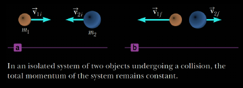
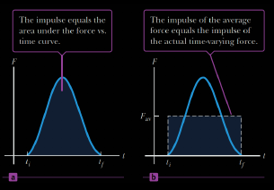
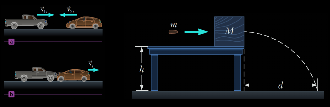
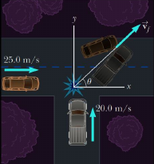

# Lecture 7 - Momentum

## Momentum and Impulse

### Momentum

> Is a `vector quantity` with the same direction as the object `velocity`. Its components are given in two dimensions

$$\mathcal{P_x} = m \mathcal{v_x} \text{ and } \mathcal{P_y} = m  \mathcal{v_y}$$

__Linear momentum__ of an object of mass $m$ is defined as

$$\vec{P} = m \vec{v}$$

__Newton's second low and momentum__

  $$\vec{F_{net}} = m \vec{a} = m \frac{\Delta \vec{v}}{\Delta t} = \frac{\Delta (m \vec{v})}{\Delta t}$$

Thus $\vec{F_{net}} = \frac{\Delta \vec{p}}{\Delta t}$ 

#### Conservation of Momentum

When no net external force acts on an isolated system, the total momentum of the system is constant. This principle is called `conservation of momentum`

$$\bf{m_1 \vec{V_{1i}} + m_2 \vec{V_{2i}} = m_1 \vec{V_{1 \mathord{\mathit{f}}}} + m_2 \vec{V_{2 \mathord{\mathit{f}}}}}$$

  

### Impulse

__Impulse__ of a force delivered to an object is equal to the `product` of the force and the `time interval` during which the force act

  $$\vec{I} = \vec{F} \Delta t$$

  * The __magnitude__ of the impulse delivered by a force during the time interval is equal to the area under the force vs time graph o equivalent to average force multiplied by time interval

  $$\vec{F_{avg}} \Delta t = \Delta \vec{p}$$

  

* The __Impulse - Momentum theorem__ states that the impulse of a constant force delivered to an object is equal to the change in momentum of the object

$$\bf{\vec{I} = \vec{F} \Delta t = \Delta \vec{p} = m \vec{v_ \mathord{\mathit{f}}} - m \vec{v_i}}$$

That equality is true even if the fore is not constant, as long as the time interval is taken to be arbitrarily small

## Collisions 

### Inelastic Collisions

* In an `inelastic collision`, the `momentum` of the system is __conserved__, but the `kinetic energy` is __NOT__
* In a `perfectly inelastic collision`, the `momentum` of the system is __conserved__, but the `kinetic energy` if __NOT__
  * Additionally the colliding objects __stick together__

  

### Elastic Collisions

In an `elastic collision`, both the `momentum` and the `kinetic energy` of the system are __conserved__

  * Before an `elastic collision` the two objects move independently
  * After the `elastic collision` the object `velociteis` change, but both the `energy` and `momentum` of the system are conserved

Thus the [momentum is conserved](#conservation-of-momentum)

* A _one-dimensional_ `elastic collision` between two objects can be solved by 
* using the [conservation of momentum](#conservation-of-momentum)

$$m_1 \vec{v_{1i}} + m_2 \vec{v_{2i}} = m_1 \vec{v_{1 \mathord{\mathit{f}}}} + m_2 \vec{v_{2 \mathord{\mathit{f}}}}$$ 

* And  the [conservation of energy](./w5-work.md#energy-conservation) 

$$\frac{1}{2} m_1 v^2_{1i} + \frac{1}{2} m_2 v^2_{2i} = \frac{1}{2} m_1 v^2_{1 \mathord{\mathit{f}}} + \frac{1}{2} m_2 v^2_{2 \mathord{\mathit{f}}}$$

* Derived from two equations above:

$$v_{1i} - v_{2i} = - (v_{1 \mathord{\mathit{f}}} - v_{2 \mathord{\mathit{f}}})$$

> [!NOTE]
> Energy is not conserved in `inelastic collision`, so such problems must be solved with equation of momentum conservation only

### Glancing Collisions

  

* For a collision taking place on `2D` plane, the conservation of momentum principle implies that the total `momentum` of the system in each direction is __conserved__

$$m_1 v_{1ix} + m_2 v_{2ix} = m_1 v_{1 \mathord{\mathit{f}} x} + m_2 v_{2 \mathord{\mathit{f}} x}$$

$$m_1 v_{1iy} + m_2 v_{2iy} = m_1 v_{1 \mathord{\mathit{f}} y} + m_2 v_{2 \mathord{\mathit{f}} y}$$

> [!NOTE]
> In a `two-dimensional collision` the system `momentum` is conserved, whereas the system `energy` is conserved only if the collision is __elastic__

* __Example__: Consider a two-dimensional in which an object of mass $m_1$ collides with an object of mass $m_2$ that is initially at rest. This called a `glancing collision` 

  * `x-component`: $m_1 v_{1i} + 0 = m_1 v_{1 \mathord{\mathit{f}}} \cos{\theta} + m_2 v{2 \mathord{\mathit{f}}} \cos{\Phi}$
  * `y-component`: $0 + 0 = m_1 v_{1 \mathord{\mathit{f}}} \sin{\Theta} + m_2 v_{2 \mathord{\mathit{f}}} \sin{\Phi}$

> [!TIP]
> If the collision if `elastic`, we can write an equation for conservation of energy
>
> $$\frac{1}{2}m_1 v^2_{1i} = \frac{1}{2}m_1 v^2_{1 \mathord{\mathit{f}}} + \frac{1}{2}m_2 v^2_{2 \mathord{\mathit{f}}}$$
