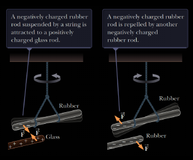
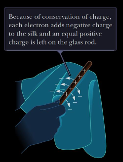
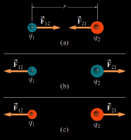
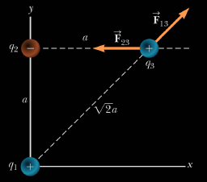
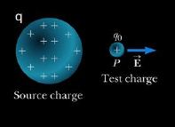
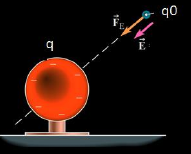

# Lecture 9 - Electric Field

## Electric Charge

* There are two kinds of `electric charge`, which are `positive` and `negative`

* Charges of the same sign repel one another and charges with opposite signs attract one another

  

* __The Consecration of Charge__: It is observed from experimental observations that electric charge id always conserved in an isolated system

  

## Coulomb's Law

> __Coulomb's Law__ 
> States that the electric force exerted by a point charge $q1$ on a second point charge

$$F_e = k_e \frac{|q1||q2|}{r^2}$$

* Where $r$ is the distance between two particles and $k_e$ is Coulomb constant
  * This constant is also written in the following form with the permittivity of free space constant as:

$$k_e = \frac{1}{4 \pi \epsilon_0} \text{ with }  \epsilon_0 = 8.8542 \times 10^{-12} \frac{C^2}{N \cdot m^2}$$

* The direction of electric force is always along the line that joins the two point charges and can be either be `attractive` or `repulsive`

  

  * When there are more than two charges are present the resultant force on any one of them equals the vector sum of the `forces` exerted by the other individual charges

  

## Electric Field

> __Electric Field__ 
> Exists in the region of space around a charged object, the source charge

The `electric field vector` at a point in space is defined as the electric force acting on a test charge (a positive charge in the example) placed at the point divided by the test charge

$$\vec{E} = \frac{\vec{F_e}}{q_o}$$

The vector $\vec{E}$ has the SI units of t newtons per coulomb $\frac{N}{C}$

| Experiment 1                         | Experiment 2                         | 
|:-------------------------------------|:-------------------------------------|
|  |  | 

## Electric Potential Energy

## Electric Potential

