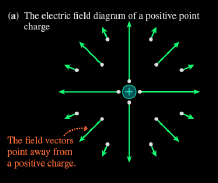
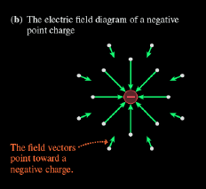
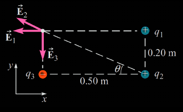
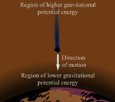
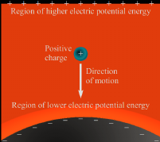
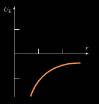
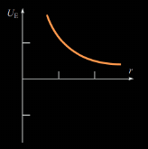
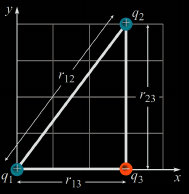

# Lecture 8 - Electric Field

## Electric Charge

* There are two kinds of `electric charge`, which are _positive_ and _negative_
* Charges of the same sign repel one another and charges with opposite signs attract one another

  

* `Charge` always occurs as `integral multiples` of a fundamental amount of charge $e$. In modern terms, the `charge` $q$ is said to be __quantized__
  * `Electric charge` exists as discrete "_packet_"
$$\bf{q = \pm Ne} \text{ where } N \text{ is some integer and } e = 1.602 \times 10^-19 \text{ Coulomb }$$
    
    * `Electron` has the charge of $-e$
    * `Proton` has the charge of $e$
    * `Neutron` has no charge

* __The Consecration of Charge__: It is observed from experimental observations that `electric charge` is always conserved in an `isolated system`

  

## Coulomb's Law

> __Coulomb's Law__ 
> States that the `electric force` exerted by a `point charge` $q1$ on a second `point charge`

[^1]$$F_e = k_e \frac{|q1||q2|}{r^2}$$
[^1]:Coulomb's Law

* Where $r$ is the distance between two particles and $k_e$ is Coulomb constant
  * This constant is also written in the following form with the permittivity of free space constant as:

[^2]$$k_e = \frac{1}{4 \pi \epsilon_0} \text{ with }  \epsilon_0 = 8.8542 \times 10^{-12} \frac{C^2}{N \cdot m^2}$$
[^2]:Constant k 

* The direction of `electric force` is always along the line that joins the two point charges and can be either be `attractive` or `repulsive`

  

  * When there are more than two `charges` are present the `resultant force` on any one of them equals the vector sum of the `forces` exerted by the other individual `charges`

  

## Electric Field

> __Electric Field__ 
> Exists in the region of space around a charged object, the source charge

The `electric field vector` at a point in space is defined as the `electric force` acting on a `test charge` (a positive charge in the example) placed at the point divided by the `test charge`

[^3]$$\vec{E} = \frac{\vec{F_e}}{q_o}$$
[^3]:eq Electric Field

The vector $\vec{E}$ has the SI units of t newtons per coulomb $\frac{N}{C}$

| Experiment 1                         | Experiment 2                         | 
|:-------------------------------------|:-------------------------------------|
|  |  | 

Consider the `electric field` due to a `single point charge` $q$
* If $q$ is _positive_ then a positive `test charge` would repelled, so the `field vector` points away from $q$ (or radically outwards)
* If $q$ is _negative_, then the `field vector` points towards $q$ (radically inwards)

| $q$ is positive                          | $q$ is negative                          | 
|:-----------------------------------------|:-----------------------------------------|
|  |  | 

Thus

[^1]$$\vec{F_e} = k_e \frac{qq_o}{r^2} \hat{r}$$

[^3]$$\vec{E} \equiv \frac{\vec{F_e}}{q_0}$$

[^4]$$\vec{E} = k_e \frac{q}{r^2} \hat{r}$$
[^4]:Electric Field due to single point charge

The `electric field` due to more than one point `charge` can be found using the principle of _superposition_: 
* The `electric field` at any point is the vector sum of the field vectors at that point caused by each charge separately

  

[^5]$$\vec{E} = k_e \sum_i \frac{q_i}{r_i^2} \hat{r_i}$$
[^5]:Electric field due to more than one point charge

## Electric Potential Energy

In [mechanical section](./w5-work.md), we learned about gravitational potential energy, which is the energy stored in gravitational field. In the similar manner, `electric potential energy` is the energy stored in an `electric field`

| Gravitational PE                              | Electrical PE                              | 
|:----------------------------------------------|:-------------------------------------------|
|  |  | 

* For both gravitational `GPE` and electric potential energy `EPE`, the change in potential energy when objects move is equal in _magnitude_ but opposite in _sign_ to the work done by the field   

[^6]$$\Delta U = - W_{field}$$
[^6]:Change in `PE`

The `EPE` for a pair of point particles is defined as

[^7]$$U = k_e \frac{q_1 q_2}{r_{12}}$$
[^7]:`EPE` of a pair of charges

* The unit for `EPE` is J 

| Electrical Attraction                | Electrical Repulsion                 | 
|:-------------------------------------|:-------------------------------------|
| $q_1 q_2 < 0$                        | $q_1 q_2 > 0$                        | 
|  |  | 

To find the `PE` due to more than two point charges, we add the potential energies of each pair of `charges`
* For three points `charges`, there are three `pairs`, so the potential energy can be written as

  

[^8]$$U_E = k \left( \frac{q_1 q_2}{r_{12}} +  \frac{q_1 q_3}{r_{13}} + \frac{q_2 q_3}{r_{23}} \right)$$
[^8]:`EPE` die to more than two charges

If no other forces act on a `point charge`, then as it moves in an `electric field`
* _The sum of the kinetic and `EPE` is constant_ 

[^9]$$K_i + U_i = K_{\mathord{\mathit{f}}} + U_{\mathord{\mathit{f}}} = \text { constant }$$
[^9]:Conservation of Engergy

## Electric Potential

Just as the `electric field` is defined as the `electric force` per unit charge, the `electric potential` _V_ is defined as the `EPE` per unit charge

[^10]$$V  = \frac{U_E}{q}$$
[^10]:Electric Potential

_The SI unit of electric potential is the joule per coulomb, which is names the volt (symbol V)_

The `potential difference` is the charge in `EPE` per unit charge

[^11]$$\Delta U_E = q \Delta V$$
[^11]:Potential Difference 

If $q$ is the _vicinity_ of one other point charge $Q$, the `EPE` is: $U = \frac{kQq}{r}$ [^12]
[^12]:`EPE` if q is vicinity of one other charge

Therefore, the electric potential at a distance $r$ from a point charge $Q$ is: $V = \frac{kQ}{r}$ [^13]
[^13]:Electric potential at a distance

The potential at point $P$ due to $N$ point charges is: $V = \sum V_i = \sum \frac{kQ_i}{r_i}$ [^14]
[^14]:Potential at point P due to N point charges

