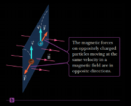

# Lecture 9 - Magnetic Field

## Current and Resistance

### Electric Current

> __The Current__ is the rate at which `charge` flows through a surface of area A

In this figure, the `charges` move in a direction perpendicular to a surface of area A

  

* Average `current` is denoted as:

[^1]$$I_{av} \equiv \frac{\Delta Q}{\Delta t}$$
[^1]:Average Current

* instantaneous `current` I is denoted as:

[^2]$$I = \lim_{\Delta t \to 0} I_{av} = \lim_{\Delta t \to 0} \frac{\Delta Q}{\Delta t}$$
[^2]:Instantaneous Current

* When `charges` flow through a surface, then can be _positive_, _negative_, or _both_. The direction of conventional current used in our context is the direction of the flow of `positive charges`

  

#### A Microscopic View

The current is related to the motion of the charge `carriers` by:

  

[^3]$$I = nqv_d A$$
[^3]:Current in a conductor

Where, 

  * $n$ is the number of `mobile charge carrier per unit volume`
  * $q$ is the charge on each carrier 
  * $v_d$ is the drift speed of the `charges`
  * $A$ is the cross-sectional area of the conductor

### Resistance

The `resistance` $R$ of a conductor is defined as the ratio of the `potential difference` across the conductor to the current in it

[^4]$$R \equiv \frac{\Delta V}{I}$$
[^4]:Resistance of a conductor

If a `conductor` has a defined `length` and `corss-sectional area`, its `resistance` is

  

[^5]$$R = p \frac{l}{A}$$
[^5]:Resistance in particular conductor

Where,

  * $p$ s an intrinsic property of the conductor called the `electrical resistivity`
  * The SI uni of resistivity is the __Ohm-meter__ ( $\Omega \cdot m$ )

### Ohm's Law

__Ohm's Law__ describes many `conductors` for which the applied `voltage` id directly proportional to the current it causes
  * The `proportionality constant` is the `resistance`

[^6]$$\Delta V = I R$$
[^6]:Ohm's Law

## Magnetism

> __Magnetism__
> Is closely linked with `electricity`. `magnetic field` affect `moving charges`, and `moving charges` produce `magnetic fields`. Changing `magnetic field` can even create `electric field`

### Magnetic Field

> [!NOTE]
> In earlier sections we described the interaction between `charges objects` in terms of `electric fields` .Recall that an `electric field` surrounds any `stationary electric charge`
> * The region of space surrounding a moving charge includes a `magnetic field` as well
> * A `magnetic field` also surrounds a properly magnetized magnetic material

| Magnetized Stationary Objects              | Earth's Magnetic Fields               | 
|:-------------------------------------------|:--------------------------------------|
|  |  | 

> [!IMPORTANT]
> Experiments show that a stationary `charged particle` doesn't interact with a static magnetic field. When the `charged particle` is moving through a `magnetic field`, however a `magnetic force` acts on it

The __magnetic force__ that acts on the charge $q$ moving with `velocity` $v$ in a `magnetic field` B has magnitude

[^7]$$F = qvB \sin{\theta}$$
[^7]:Magnetic Force

$$B \equiv \frac{F}{qv \sin{\theta}}$$

  * Where $\theta$ is the angle between $\vec{v}$ and $\vec{B}$

> [!NOTE]
> The SI unit of the `magnetic` is the tesla (T), or weber per square meter (Wb/m2). An additional commonly used unit of the `magnetic field` is the gauss (G): 1T = $10^4 \text{  } G$.
> $$[B] = T = \frac{Wb}{m^2} = \frac{N}{C \cdot m/s} = \frac{N}{A \cdot m}$$

To find the direction of
  * `positively charged particle`, use the _right-hand rule number 1_:
    * Points the fingers of your open right hand in the direction of vector $\vec{v}$ and the curl them in the direction of vector $\vec{B}$. Your thumb then points in the direction of the vector magnetic force $\vec{F}$

| Right-hand Rule                     | Direction                            | 
|:------------------------------------|:-------------------------------------|
|  |  | 

  * `negatively chage particle`, simply use the _right-hand rule_ to find the direction for positive $q$ and the reverse that direction for `negative charge`

  

### Magnetic Force on a Current-Carrying Conductor

If a straight `conductor` of length $l$, carries current $I$, the magnetic force on that `conductor` when it is placed in a uniform external `magnetic field` is

  

> The `magnetic force` on this `current-carrying conductor` is directed straight up out of the page

[^8]$$F = BIl \sin{\theta}$$
[^8]:Magnetic Force on a Current-carrying Conductor

  * Where $\theta$ is the angle between the direction of the `current` and the direction of the `magnetic field`

> [!NOTE]
> The `Right-hand Rule Number 1` also gives the direction of the `magnetic force` on the `conductor`. In this case, however, you must point your fingers in the direction of the `current` rather than in the direction of vector $\vec{v}$

### Motion of Charges Particle in a Magnetic Field

> If a `charged particle` moves in a uniform `magnetic field` so that its _initial velocity_ is perpendicular to the field, it will move in a _circular_ path in a plane perpendicular to the `magnetic field` 

The radius $r$ of the _circular_ path can be found from `Newton's second law` and `centripetal acceleration`, and is given by:

  

[^9]$$F = qvB = \frac{mv^2}{r}$$
[^9]:Tangential Force of uniform Magnetic Field

$$r = \frac{mv}{qB}$$

  * Where $m$ is the mass of the particle and $q$ is its charge

### Magnetic Field of a Long, Straight Wire and Ampere's Law

#### Magnetic Field of a wire

* The `magnetic field` at `distance` $r$ from a _long_, _straight_ wire carrying current $I$ has the magnitude: 

[^10]$$B = \frac{\mu_0 I}{2 \pi r}$$
[^10]:`MF` of a _long_, _straight_ wire  

$\mu_0 = 4 \pi \times 10^{-7} T \cdot m/A$ called the `permeability` of free space

* `right-hand rule 2` for determining the direction of the `magnetic field` dur to a long, straight wire carrying a current

  

> [!NOTE]
> Note that the `magnetic field lines` form circles around the wire

#### Ampere's Law

> _Ampere's Law_
> Can be used to find the `magnetic field` around certain simple `current-carrying conductors`

  

[^11]$$\sum B_{||} \Delta l = \mu_0 l$$
[^11]:Ampere's Law

Where

  * $B_{||}$ is the component of $\vec{B}$ tangent to a small current element of length $\Delta l$
  * Length $\Delta l$ that is part of the `closed path`
  * $I$ is the total `current` that penetrates the `closed path`

> [!NOTE]
> An `arbitrary closed path` around a `current` is used to calculate the `magnetic field` of the `current` by the use of `Ampere's rule`
> Recall $\sum B_{||} \Delta l = B(2 \pi r) = \mu_0 I$

### Magnetic Force Between Two Parallel Conductors

The force per unit length on each of two parallel wires separated by the distance $d$ and `carrying-current` $I_1$ and $I_2$ has the magnitude 

[^12]$$\frac{F}{l} = \frac{\mu_0 I_1 I_2}{2 \pi d}$$
[^12]:Force per unit Length on each of two parallel conductors

The `forces` are _attractive_ if the `currents` are in the same `direction` and _repulsive_ if they are in opposite `directions` 

  

$$B_2 = \frac{\mu_0 I_2}{2 \pi d}$$

[^13]$$F_1 = B_2 I_1 l = \left( \frac{\mu_0 I_2}{2 \pi d} \right) I_1 l = \frac{\mu_0 I_1 I_2 l}{2 \pi d}$$
[^13]:Magnetic force between two Parallel Conductors

### Magnetic Field of Current Loops and Solenoids

  

> `magnetic field lines` for a `current loop`. Note that the lines resemble those of a bar magnet

#### Magnetic Field of Current Loops

> The `magnetic field` at the center of a coil of N circular loops of radius $R$, each carrying current $I$, is given by:

[^14]$$B = N \frac{\mu_0 I}{2R}$$
[^14]:Magnetic field of current loops

#### Magnetic Field of Solenoids

> If a long, straight wire is bent into a coil of several closely spaced loops, the resulting device is a `solenoid`, often called an `electromagnet`

> [!NOTE]
> This device is important in many applications because it acts as a magnet only when it carries a current

The `magnetic field` inside a `solenoid` has the magnitude

[^15]$$B = \mu_0 n I$$
[^15]:Magnetic Field in solenoids

  * Where $n = \frac{N}{l}$ is the number of turns of wire per unit length

